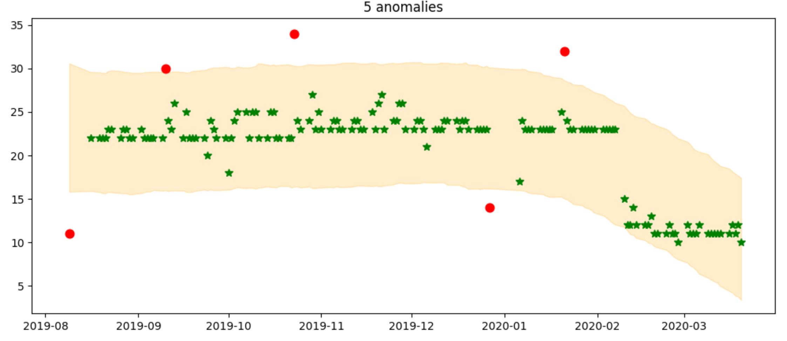
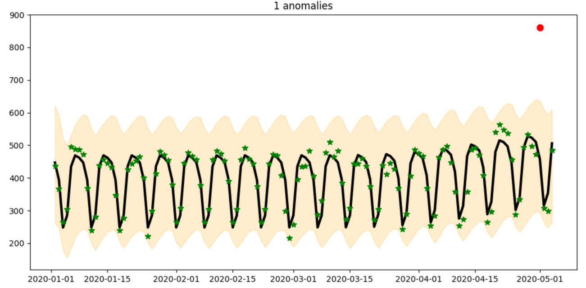
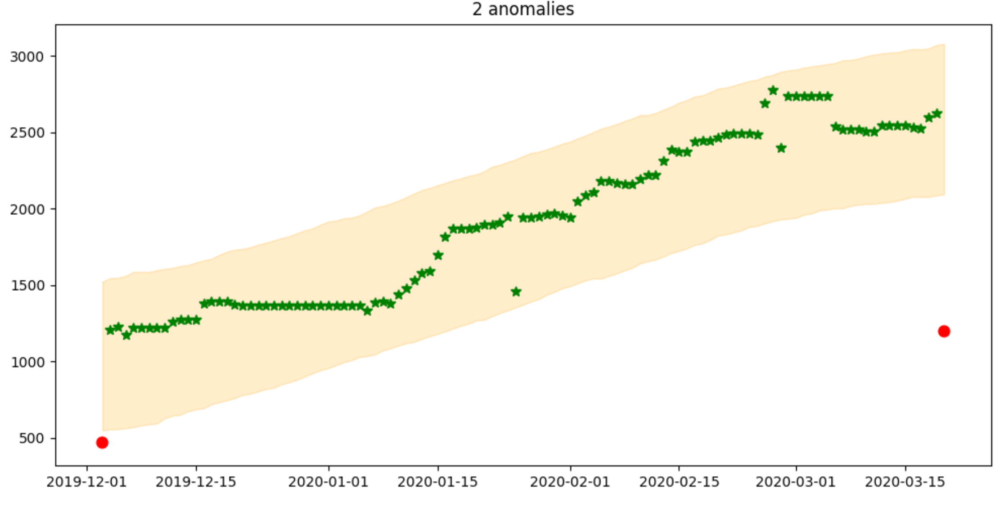
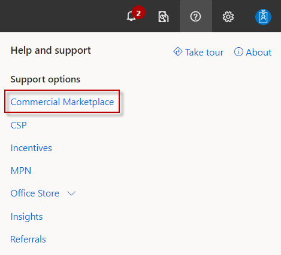

# Anomaly detection service for metered billing

The [Marketplace metering service](../marketplace-metering-service-apis-faq.md) lets you create offers in the commercial marketplace program that are charged according to non-standard units. With metered billing, you send usage events for your customer’s usage to Microsoft and we prepare the billing based on that usage.

Incorrect usage data could come from a variety of causes, such as bugs, misconfigurations in your consumption tracking, or fraud. Incorrect usage data would result in incorrect customer charges and billing disputes.

To mitigate the risk, our anomaly detection service applies machine learning algorithms to determine normal metered billing behavior, analyze the metered billing usage, and discover anomalies with minimal user intervention.

You are notified if there is anomaly detected in your metered billing usage. This gives you an opportunity to investigate and notify us if an anomaly is confirmed to be a real issue, at which point actions can be taken to address the customer billing issue proactively.

In addition to sudden spikes, dips, and trend changes of metered billing usage, our model also accounts for seasonal effects. Because metered billing is communicated via overage data, our model is also able to gracefully handle long periods of missing data.

Following are examples of anomaly detection results. The expected range shows as a yellow band. Acceptable metered billing usage shows as green stars in the band. Billing usage outside the band displays as a red dot.  

Anomalies detected outside a predictable trend:

Anomalies detected outside a recurring cyclic trend:

Anomalies detected in an upward trend:

## How anomaly detection service works

Anomaly detection is enabled automatically for all metered billing usage. When you submit the usage events to Microsoft, anomaly detection service creates a model of expected values based on past usage data. This model runs weekly.

Anomaly detection functions on a per-meter and per-customer level. This means each meter with each customer will have a model trained based on this customer’s past usage pattern of this meter.

The model works by generating retrospective confidence intervals. The time series forecast is a generalized additive model consisting of a trend prediction part and a seasonality part. Because the model is formulated as a regression task, it can gracefully handle long periods of missing data. If an observation falls outside of the predicted confidence intervals, it means that observation cannot be explained based on historical patterns of the metered billing and therefore may be an anomaly.

## Anomaly detection notification

You can evaluate, manage, and acknowledge anomalies in Partner Center. To learn how, see [Manage metered billing anomalies in Partner Center](../anomaly-detection.md).

To ensure that your customers are not overcharged for metered usage, you should investigate if detected anomalies are real issues. If so, you can acknowledge the incorrect usage in Partner Center.

We recommended that you confirm if detected anomalies are normal usage. Doing so will improve the anomaly data we provide to you. If an anomaly represents a potentially high financial risk, we may contact you to confirm the usage.

## When and how to get support

If you sent us an incorrect metered usage that did or will result in an undercharge to the customer, we will not initiate a bill to the customer for under-reported usage or pay you for that usage. You will have to bear the loss of revenue due to under-reporting.

If one of the following cases applies, you can adjust the usage amount in Partner Center which will result in a refund or billing adjustment for your customers:

- You confirmed that one of the anomalies we found is a real issue and the incorrect usage would result in overcharging the customer.
- You discover that you sent incorrect usage to us and the incorrect usage would result in overcharging the customer.

To submit a support ticket related to metered billing anomalies:

1. Sign in to [Partner Center](https://partner.microsoft.com/dashboard/commercial-marketplace/overview) with your work account.
1. In the menu on the upper-right of the page, select the **Support** icon. The **Help and support** pane appears on the right side of the page.
1. For help with the commercial marketplace, select **Commercial Marketplace**.
   
1. In the **Problem summary** box, enter **commercial marketplace > metered billing**.
1. In the **Problem type** box, select one of the following:
    - **Commercial Marketplace > Metered Billing > Wrong usage sent for Azure Applications offer**
    - **Commercial Marketplace > Metered Billing > Wrong usage sent for SaaS offer**
1. Under **Next step**, select **Review solutions**.
1. Review the recommended documents, if any or select **Provide issue details** to submit a support ticket.

For more publisher support options, see [Support for the commercial marketplace program in Partner Center](../support.md).

## Next steps

- Learn about the [Marketplace metering service API](../marketplace-metering-service-apis.md).
- [Manage metered billing anomalies in Partner Center](../anomaly-detection.md)